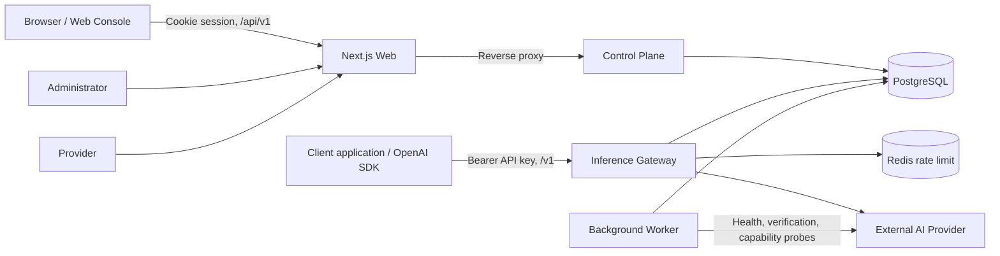
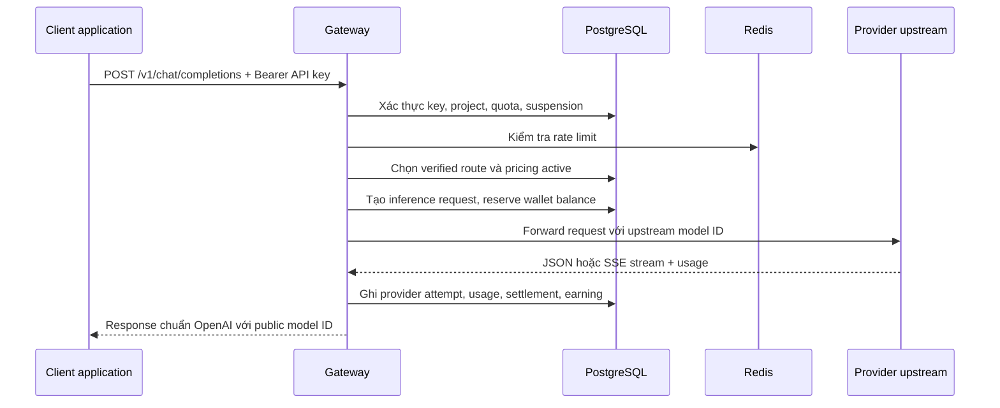
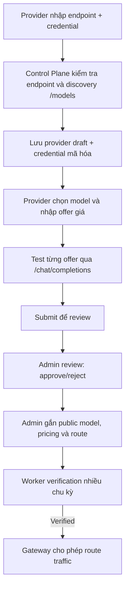

# Proposal hệ thống LLMHub

**Phiên bản:** 1.0  
**Ngày:** 2026-09-15  
**Trạng thái:** Đề xuất phát triển và vận hành pilot  

---

## 1. Tóm tắt đề xuất

LLMHub (tên trước đây: LLMProxy) là nền tảng **LLM Gateway và model marketplace** cung cấp một API tương thích OpenAI cho các ứng dụng cần sử dụng mô hình AI tạo sinh từ nhiều nhà cung cấp khác nhau.

Thay vì để mỗi đội ngũ tích hợp riêng OpenAI, Anthropic, mô hình nội bộ hoặc các provider OpenAI-compatible, client chỉ cần gọi một endpoint của LLMHub. Nền tảng chịu trách nhiệm xác thực API key, kiểm soát hạn mức, chọn tuyến provider, chuyển tiếp inference, kiểm tra chất lượng route, theo dõi usage, thu phí prepaid và tính doanh thu cho provider.

Đề xuất này hướng đến việc chuẩn hóa LLMHub thành một sản phẩm pilot có thể vận hành an toàn, sau đó mở rộng dần thành nền tảng quản lý tiêu thụ AI tập trung.

### Giá trị cốt lõi

- **Một API thống nhất:** client dùng chuẩn OpenAI (`/v1/models`, `/v1/chat/completions`, `/v1/responses`).
- **Giảm phụ thuộc provider:** thay đổi hoặc bổ sung upstream mà không bắt client đổi SDK/tích hợp.
- **Kiểm soát chi phí:** reserve tiền trước request, settlement theo usage và ledger truy vết được.
- **Độ tin cậy:** chỉ route tới provider/model đã được duyệt, kiểm tra health và verification độc lập.
- **Quản trị tập trung:** console cho khách hàng, provider và platform administrator.
- **Mô hình marketplace:** provider có thể đăng ký endpoint/model/giá, còn admin kiểm soát publication và chất lượng.

---

## 2. Bối cảnh và vấn đề cần giải quyết

### 2.1. Hiện trạng phổ biến

Các ứng dụng AI thường gặp các vấn đề sau:

1. Tích hợp trực tiếp nhiều provider dẫn đến code client phức tạp, khó thay đổi model và khó kiểm soát lỗi.
2. Chi phí bị phân tán theo nhiều tài khoản, không có một nguồn usage/billing tập trung.
3. Không có cơ chế xác minh upstream đang phục vụ đúng model đã quảng bá.
4. Không có fallback có kiểm soát khi provider chậm hoặc lỗi.
5. Khó mở rộng thành mô hình cung cấp model từ nhiều đối tác/provider.
6. Credential upstream dễ bị rò rỉ nếu được lưu hoặc truyền không đúng cách.

### 2.2. Vấn đề nghiệp vụ

| Đối tượng | Vấn đề |
|---|---|
| Đội phát triển/client | Phải quản lý nhiều SDK, API key, format request, quota và hóa đơn provider. |
| Đơn vị vận hành | Không có một nơi duy nhất để kiểm tra chi phí, lỗi request, route, health và sự cố billing. |
| Provider model | Thiếu quy trình chuẩn để đưa endpoint/model vào catalog và nhận thanh toán theo usage. |
| Quản trị hệ thống | Khó bảo đảm endpoint được đưa vào phục vụ là an toàn, đúng model, đúng giá và có bằng chứng kiểm tra. |

---

## 3. Mục tiêu

### 3.1. Mục tiêu giai đoạn pilot

1. Cung cấp API inference tương thích OpenAI cho chat completion và responses.
2. Cho phép khách hàng tạo API key, nạp prepaid credit và theo dõi usage/chi phí.
3. Cho phép provider kết nối endpoint OpenAI-compatible, khai báo offer và submit review.
4. Cho phép admin duyệt provider, tạo public model, cấu hình giá và route.
5. Chỉ route request tới route có verification hợp lệ và health đạt yêu cầu.
6. Lưu đầy đủ dữ liệu request, billing reservation, final charge, provider earning và audit event.
7. Triển khai được trên môi trường AWS private-by-default, có TLS, secrets và monitoring.

### 3.2. Mục tiêu dài hạn

- Hỗ trợ đa tổ chức (multi-tenant) và RBAC đầy đủ.
- Mở rộng adapter cho provider không hoàn toàn OpenAI-compatible.
- Bổ sung routing policy theo chi phí, độ trễ, khu vực, năng lực model và SLA.
- Tích hợp payment provider thực tế và tự động payout.
- Xây dựng analytics, alerting và báo cáo tài chính nâng cao.
- Hỗ trợ thêm loại inference: embeddings, image, audio, batch và tool calling chuẩn hóa.

### 3.3. Ngoài phạm vi pilot

- Xây dựng mô hình nền tảng (foundation model) riêng.
- Lưu hoặc huấn luyện trên nội dung prompt/response của khách hàng.
- Cam kết SLA enterprise ngay từ phiên bản đầu.
- Tự động route lại sau khi client đã nhận dữ liệu streaming đầu tiên.

---

## 4. Đối tượng sử dụng và quyền hạn

### 4.1. Buyer / Developer

Buyer là người dùng API để tích hợp AI vào ứng dụng của họ.

Khả năng chính:

- Đăng nhập web console.
- Tạo/revoke project API key.
- Xem model public trong catalog.
- Gửi inference request qua Gateway.
- Xem usage, chi phí, wallet, ledger và payment history.

### 4.2. Provider

Provider là bên vận hành một hoặc nhiều endpoint model upstream.

Khả năng chính:

- Tạo provider draft bằng endpoint, loại authentication và credential.
- Cho LLMHub discovery danh sách model từ upstream.
- Chọn model, đặt giá bán mong muốn theo token.
- Test offer bằng request do server tạo.
- Submit offer/provider để admin duyệt.
- Xem trạng thái health, capability check, earnings và payouts.

### 4.3. Platform administrator

Platform administrator là vai trò vận hành, được xác định server-side bằng immutable OIDC identity cấu hình trong môi trường production.

Khả năng chính:

- Duyệt/từ chối/tạm dừng provider.
- Tạo public catalog model, pricing version và route.
- Publish model khi đã đạt điều kiện.
- Kiểm tra verification evidence, health, request detail và audit events.
- Xử lý payment confirmation, refund, adjustment, payout và global suspension.

> **Lưu ý hiện trạng:** hệ thống hiện là single-tenant. Tất cả user đã xác thực cùng nhìn thấy customer resources dùng chung (project, wallet, usage và provider workflow). Chỉ quyền platform administrator được tách biệt. Đây là giới hạn phải được nêu rõ khi pilot và là hạng mục ưu tiên nếu mở rộng cho khách hàng độc lập.

---

## 5. Kiến trúc đề xuất



### 5.1. Thành phần hệ thống

| Thành phần | Công nghệ | Trách nhiệm |
|---|---|---|
| Web Console | Next.js 16, React, TypeScript | UI cho customer, provider và admin; proxy management API cùng origin. |
| Control Plane | Go | Identity, session, projects, API key lifecycle, catalog, provider onboarding, wallet, payment và admin operation. |
| Gateway | Go | OpenAI-compatible inference API; API-key auth, quota, rate limit, routing, streaming, failover và billing settlement. |
| Worker | Go | Reconciliation, provider health, route verification, capability check, outbox và retention. |
| PostgreSQL | PostgreSQL 17 | Nguồn dữ liệu chính: identity, catalog, routes, request, usage, wallet, ledger, provider earning và audit. |
| Redis | Redis 7 | State rate limit phân tán của Gateway. |
| AWS/ECS production | ALB, ECS/Fargate, RDS, ElastiCache, Secrets Manager, CloudWatch | Hạ tầng triển khai private-by-default, TLS và observability. |

### 5.2. Phân tách control plane và data plane

- **Control plane** xử lý quản trị và nghiệp vụ ít nhạy cảm với độ trễ: user/session, provider, model catalog, giá, payment, dashboard.
- **Data plane/Gateway** xử lý inference runtime: độ trễ thấp, streaming, routing, API key, rate limit và billing reservation.
- **Worker** xử lý công việc định kỳ/không đồng bộ, không nằm trên đường request inference của client.

Việc phân tách này giúp thay đổi UI hoặc nghiệp vụ quản trị không ảnh hưởng trực tiếp đến hiệu năng inference.

---

## 6. Luồng nghiệp vụ chính

### 6.1. Luồng đăng nhập và quản lý console

```text
Browser
  → Web Console
  → /api/v1/auth/login (OIDC) hoặc dev-login ở local
  → Control Plane tạo/đọc user và session
  → Set HttpOnly session cookie
  → Browser truy cập console và gọi /api/v1/*
```

- Production dùng OIDC authorization-code flow.
- Development có thể dùng dev-login khi `DEV_AUTH_ENABLED=true`.
- Session được lưu server-side trong PostgreSQL.
- API management dùng cookie session; inference không dùng session cookie.

### 6.2. Luồng sử dụng inference của buyer



Chi tiết xử lý:

1. Client gửi request theo OpenAI schema tới `/v1/chat/completions` hoặc `/v1/responses`.
2. Gateway kiểm tra bearer API key, trạng thái revocation, account suspension và project quota.
3. Gateway kiểm tra rate limit theo API key, dùng Redis khi được cấu hình.
4. Gateway chỉ load route đủ điều kiện: model đã publish, provider approved, route enabled, pricing active, health hợp lệ, verification đạt yêu cầu.
5. Gateway ước lượng token input và output ceiling; tạo `inference_request` và reserve số tiền tối đa từ wallet trước khi gọi upstream.
6. Gateway giải mã credential provider trong bộ nhớ, gọi upstream với model ID nội bộ của provider.
7. Gateway xác minh upstream trả đúng model; sau đó thay model ID trên response thành public model ID của LLMHub.
8. Khi usage có sẵn, Gateway finalizes billing, hoàn phần reserve dư và ghi provider earning.
9. Client nhận response tương thích OpenAI, không cần biết provider nào thực thi request.

### 6.3. Luồng streaming và failover

- Gateway hỗ trợ SSE cho chat completions và responses.
- Gateway có thể thử route/provider kế tiếp **chỉ trước khi dữ liệu streaming đầu tiên được gửi tới client**.
- Sau event stream đầu tiên, request không được retry trên provider khác để tránh sinh nội dung trùng lặp hoặc khác biệt.
- Response stream có byte ceiling, flush gia tăng và header chống buffering trung gian.
- Nếu upstream trả sai model identity, Gateway revoke verification của route và chặn route khỏi các request sau.

### 6.4. Luồng billing prepaid

```text
Request đến Gateway
  → Ước tính số tiền tối đa theo input + output ceiling
  → Reserve: available_balance giảm, reserved_balance tăng
  → Gọi upstream
  → Nhận usage thực tế hoặc dùng reservation estimate an toàn
  → Finalize: final charge được ghi vào ledger
  → Hoàn phần reserve dư (nếu có)
  → Ghi provider earning theo attempt thành công
```

Các trạng thái lỗi chính:

- Wallet không đủ credit: trả `402 insufficient_credit`.
- Vượt quota project: trả `429 quota_exceeded`.
- Không có route khỏe/verified: trả `503 provider_unavailable`.
- Model chưa publish: trả `404 model_not_found`.
- Usage vượt reservation: wallet có thể âm, tạo reconciliation alert và chặn reservation mới.

### 6.5. Luồng provider onboarding



Yêu cầu trước khi provider có traffic:

- Endpoint hợp lệ và không vi phạm SSRF policy.
- Production bắt buộc HTTPS.
- Provider credential được mã hóa khi lưu và không trả lại qua API.
- Provider/offer được admin duyệt.
- Public model có giá active và được publish.
- Route được worker verify thành công; identity evidence còn mới.

### 6.6. Luồng worker verification

Worker chạy định kỳ ba nhóm probe cho từng route:

| Probe | Mục đích |
|---|---|
| `identity` | Xác nhận upstream trả về đúng upstream model ID. |
| `schema` | Xác nhận completion response có cấu trúc cần thiết. |
| `stream` | Xác nhận SSE có event dữ liệu và marker `[DONE]`. |

Một route cần ba chu kỳ verification pass liên tiếp để thành `verified`. Identity mismatch dẫn đến trạng thái `revoked`. Route verified nhưng không có identity evidence trong 24 giờ sẽ bị degrade và không còn đủ điều kiện route.

---

## 7. Dữ liệu và các thực thể chính

| Nhóm | Thực thể chính | Vai trò |
|---|---|---|
| Identity | `users`, `sessions`, `projects`, `api_keys`, `audit_events` | User login, project boundary, API credential và audit. |
| Catalog/routing | `providers`, `provider_credentials`, `provider_models`, `models`, `model_routes`, `pricing_versions` | Quản lý model public, implementation upstream, giá và route. |
| Reliability | `provider_health_state`, `provider_health_snapshots`, `route_verification_state`, `verification_runs`, `verification_probes` | Theo dõi health và bằng chứng verification. |
| Inference | `inference_requests`, `provider_attempts`, `usage_records`, `outbox_events` | Theo dõi request, attempt, usage và sự kiện bất đồng bộ. |
| Billing | `wallets`, `ledger_entries`, `balance_reservations`, `payments`, `refunds`, `administrative_adjustments` | Số dư, reservation, ledger và các điều chỉnh tiền. |
| Provider finance | `provider_earnings`, `payouts` | Ghi nhận nghĩa vụ thanh toán với provider. |
| Protection | `account_suspensions`, `reconciliation_alerts`, `oidc_states` | Kill switch toàn hệ thống, alert và OIDC state. |

Nguyên tắc dữ liệu:

- Ledger có tính append-only để truy vết tài chính.
- Pricing version bất biến để tính lại historical charge chính xác.
- Provider credential không được log/trả API; chỉ lưu ciphertext + nonce.
- Mỗi inference request có request ID, provider attempt và settlement state để điều tra sự cố.

---

## 8. API contract

### 8.1. Inference API

| Endpoint | Mục đích | Xác thực |
|---|---|---|
| `GET /v1/models` | Danh sách public model | Bearer project API key |
| `POST /v1/chat/completions` | Chat completion OpenAI-compatible | Bearer project API key |
| `POST /v1/responses` | Responses API-compatible | Bearer project API key |

Ví dụ client:

```bash
curl https://api.example.com/v1/chat/completions \
  -H "Authorization: Bearer $LLMHUB_API_KEY" \
  -H "Content-Type: application/json" \
  -d '{
    "model": "<published-model-id>",
    "messages": [{"role": "user", "content": "Xin chào"}],
    "max_completion_tokens": 256
  }'
```

### 8.2. Management API

Management API nằm dưới `/api/v1`, dùng cookie session.

Các nhóm endpoint:

- Authentication: login, callback, logout, session, me.
- Customer: projects, API keys, wallet, ledger, usage, payments.
- Provider: connect, discover, offers, test, submit, health, earnings, payouts.
- Catalog: public catalog models và verification evidence an toàn cho buyer.
- Admin: provider review, model/pricing/route, payment/refund/adjustment/payout, audit, suspension.

OpenAPI contract chính nằm tại `docs/openapi.yaml`.

---

## 9. Yêu cầu phi chức năng

### 9.1. Bảo mật

1. Không log provider credential hoặc plaintext API key.
2. API key chỉ trả plaintext tại thời điểm tạo; database lưu hash.
3. Provider credential mã hóa AES-GCM, hỗ trợ keyring để key rotation.
4. Production yêu cầu HTTPS cho provider endpoint và credential submission.
5. Chống SSRF: từ chối loopback, private, link-local, multicast, unspecified và các dải IP reserved.
6. Không follow redirect khi gọi provider endpoint.
7. Platform admin kiểm tra server-side theo OIDC issuer/subject; không tin role từ client.
8. Có global account suspension để dừng console customer và API key trong tình huống khẩn cấp.
9. Payment webhook yêu cầu signature và xử lý idempotent.

### 9.2. Độ tin cậy

- Provider health check định kỳ và passive health update từ request thật.
- Route verification độc lập với runtime traffic.
- Failover trước streaming; không duplicate request sau first token.
- Timeout inference mặc định 5 phút; graceful drain khi SIGTERM.
- Retry/failover không được làm trạng thái billing bị double charge.
- Reconciliation xử lý reservation stale và alert bất thường billing.

### 9.3. Hiệu năng

- Gateway không phụ thuộc Control Plane trên mỗi request; Gateway đọc dữ liệu runtime trực tiếp từ PostgreSQL.
- Redis dùng cho rate limit dùng chung giữa nhiều Gateway instance.
- Streaming flush incremental và không đặt fixed HTTP write timeout tại Gateway.
- Giới hạn request body, response bytes và stream bytes để chống resource exhaustion.

### 9.4. Quan sát và vận hành

- `/healthz`, `/readyz`, `/metrics` ở từng service nội bộ.
- CloudWatch logs/alarms cho ALB 5xx, health target, ECS CPU, RDS storage và Redis eviction.
- Audit event cho các thao tác quản trị/bảo mật quan trọng.
- Request ID phải được truyền và log xuyên suốt Gateway/provider attempt.

---

## 10. Triển khai và môi trường

### 10.1. Local development

- Docker Compose chạy PostgreSQL, Redis, Control Plane, Gateway và Worker.
- Next.js chạy hot reload tại port `3001`.
- Control Plane: `8081`; Worker: `8082`; Gateway: `8083`.
- Migration dùng PostgreSQL advisory lock và backup confirmation gate.

### 10.2. Production baseline

- AWS ALB là public entry point duy nhất.
- ECS/Fargate chạy web, control-plane, gateway và worker trong private subnet.
- RDS PostgreSQL và Redis private, không public endpoint.
- App hostname route UI và `/api/v1/*` vào web/control-plane.
- API hostname chỉ route `/v1/*` vào Gateway.
- Secrets đưa vào service qua AWS Secrets Manager.
- Production yêu cầu ít nhất hai task cho service public theo baseline infrastructure.

---

## 11. Kế hoạch phát triển đề xuất

### Phase 0 — Khảo sát, ổn định nền tảng (1–2 tuần)

**Mục tiêu:** xác nhận source of truth, hoàn thiện môi trường và chốt pilot contract.

- Kiểm kê API, migration, biến môi trường và deployment configuration.
- Chạy migration replay, Go tests, TypeScript lint/build và deployment config validation.
- Chốt danh sách provider/model đầu tiên và pricing policy.
- Chuẩn hóa brand còn sót từ `LLMProxy` sang `LLMHub` trong UI, docs, env, URL và telemetry.
- Viết runbook cho onboarding provider, fund wallet, publish route, rollback và incident.

**Tiêu chí hoàn thành:** môi trường staging tái tạo được, một provider test có thể được publish end-to-end.

### Phase 1 — Pilot inference an toàn (2–4 tuần)

**Mục tiêu:** buyer gọi thành công model đã kiểm chứng qua Gateway.

- Hoàn thiện OIDC production và invitation flow.
- Onboard ít nhất một provider OpenAI-compatible.
- Tạo catalog model, pricing, route và verification evidence.
- Thử nghiệm non-streaming + streaming qua TLS edge.
- Kiểm tra reserve/finalize/release billing với các case success, timeout, upstream error, identity mismatch.
- Thiết lập CloudWatch alarm, dashboard và on-call route.

**Tiêu chí hoàn thành:** request có API key, model verified, wallet funded và usage/ledger hiển thị nhất quán trên console.

### Phase 2 — Vận hành marketplace có kiểm soát (4–6 tuần)

**Mục tiêu:** provider tự onboarding và admin vận hành được marketplace nhỏ.

- Hoàn thiện provider wizard và error states.
- Chuẩn hóa quy trình review: SLA, security questionnaire, pricing/margin, model test policy.
- Kích hoạt manual payment/webhook và quy trình payment confirmation.
- Kiểm tra provider earnings, payout maker-checker và refund/adjustment.
- Xây dựng operational dashboard cho provider failure, verification freshness, billing alert.

**Tiêu chí hoàn thành:** có thể thêm provider mới mà không cần can thiệp database thủ công; mọi route có evidence và audit trail.

### Phase 3 — Mở rộng sản phẩm (sau pilot)

**Mục tiêu:** chuẩn bị scale khách hàng và use case đa dạng.

Ưu tiên đề xuất:

1. Multi-tenant + organization RBAC.
2. Routing policy động (cost/latency/availability/region).
3. Adapter abstraction thực tế cho nhiều provider protocol.
4. Payment/payout automation.
5. Usage analytics, budget alert, export báo cáo.
6. Support embeddings, batch, image/audio và tool use.
7. Caching, semantic routing, model fallback policy cấu hình được.

---

## 12. Rủi ro và phương án giảm thiểu

| Rủi ro | Ảnh hưởng | Giảm thiểu |
|---|---|---|
| Provider trả sai model hoặc thay đổi behavior | Sai chất lượng/sai billing | Identity/schema/stream verification; runtime mismatch revoke route. |
| Provider outage hoặc latency cao | Request thất bại | Health checks, passive health, pre-stream failover, route priority. |
| Upstream usage thiếu hoặc vượt estimate | Sai lệch billing | Conservative reserve, final settlement, negative-balance alert, reconciliation. |
| Credential bị lộ | Rủi ro bảo mật nghiêm trọng | Encryption at rest, no-return policy, key rotation, secrets manager, TLS. |
| SSRF từ provider endpoint | Truy cập hạ tầng nội bộ | URL/IP filtering, restricted dialer, HTTPS policy, no redirects. |
| Single-tenant gây lộ dữ liệu giữa khách hàng | Không thể mở rộng SaaS an toàn | Giới hạn pilot một customer namespace; ưu tiên multi-tenant/RBAC trước commercial scale. |
| Streaming bị timeout bởi proxy | Trải nghiệm lỗi | Đồng bộ ALB/CDN/proxy idle timeout >= Gateway request timeout; live edge tests. |
| Payment xử lý trùng | Sai số dư | Idempotency key, webhook event persistence, admin confirmation/audit. |

---

## 13. KPI và tiêu chí thành công pilot

### KPI kỹ thuật

- Tỷ lệ Gateway request thành công theo model/provider.
- P50/P95 latency và time-to-first-token cho streaming.
- Tỷ lệ route đang `verified` và freshness identity dưới 24 giờ.
- Tỷ lệ lỗi theo error class: timeout, rate-limited, malformed response, identity mismatch.
- Tỷ lệ stale reservation/reconciliation alert.
- Không có double charge hoặc final ledger inconsistency trong test/production incident review.

### KPI sản phẩm/nghiệp vụ

- Số project API key hoạt động.
- Số request/token theo public model.
- Prepaid credit nạp, consumed và outstanding provider earnings.
- Thời gian trung bình provider onboarding đến verified route.
- Tỷ lệ provider offer được duyệt.
- Tỷ lệ client tiếp tục dùng API sau lần request đầu tiên.

### Tiêu chí Go/No-Go

Pilot có thể mở cho user giới hạn khi:

1. OIDC, TLS, secrets và logging policy đã cấu hình production.
2. Có ít nhất một public model với route verified và health ổn định.
3. Luồng key → fund wallet → inference → usage → logout đã kiểm tra end-to-end qua TLS edge.
4. Streaming đảm bảo first event, completion `[DONE]`, một terminal billing reservation và không retry sau first delta.
5. Dashboard/alert cho 5xx, health, verification và billing reconciliation hoạt động.
6. Có runbook rollback, incident, refund và provider suspension.

---

## 14. Quyết định kiến trúc cần chốt

1. **Mô hình tenancy:** pilot tiếp tục single-tenant hay bắt đầu multi-tenant ngay?  
   Khuyến nghị: single-tenant cho pilot đóng, nhưng không mở nhiều khách hàng độc lập trước khi hoàn tất tenant isolation và RBAC.

2. **Đối tượng provider ban đầu:** chỉ nhận OpenAI-compatible provider hay đầu tư adapter ngay?  
   Khuyến nghị: giới hạn OpenAI-compatible trong pilot để giảm rủi ro protocol; thiết kế adapter interface cho phase sau.

3. **Payment:** manual confirmation/webhook hay tích hợp cổng thanh toán chính thức?  
   Khuyến nghị: manual/webhook cho pilot nhỏ; triển khai payment automation trước khi scale volume.

4. **Pricing:** markup cố định, pricing từng model hoặc routing theo margin?  
   Khuyến nghị: bắt đầu pricing version rõ ràng theo 1M input/output/cached tokens; chỉ tự động tối ưu margin sau khi có đủ dữ liệu cost/latency.

5. **Data retention:** có lưu prompt/response không?  
   Khuyến nghị: mặc định không lưu raw prompt/response; chỉ lưu metadata, usage, error class và hash/evidence tối thiểu trừ khi khách hàng chủ động đồng ý.

---

## 15. Kết luận

LLMHub là nền tảng hạ tầng để tổ chức sử dụng và phân phối LLM một cách có kiểm soát. Điểm khác biệt không nằm ở việc “gọi một model AI”, mà ở khả năng tạo một lớp trung gian đáng tin cậy giữa client và nhiều provider:

```text
Một API chuẩn hóa
+ routing có kiểm chứng
+ prepaid billing có ledger
+ provider onboarding có review
+ observability và audit
= nền tảng LLM Gateway/Marketplace có thể vận hành thương mại
```

Đề xuất khuyến nghị triển khai theo hướng **pilot giới hạn, một tenant dùng chung, provider OpenAI-compatible, billing prepaid có kiểm soát và verification bắt buộc**. Sau khi xác nhận nhu cầu, chất lượng route và quy trình vận hành, hệ thống nên ưu tiên multi-tenant/RBAC, payment automation và routing policy trước khi mở rộng thương mại.

---

## Phụ lục A — Liên kết repository liên quan

- Tổng quan và local setup: [`README.md`](../README.md)
- OpenAPI contract: [`docs/openapi.yaml`](openapi.yaml)
- Database architecture: [`docs/database-architecture.md`](database-architecture.md)
- Frontend design: [`docs/frontend-design.md`](frontend-design.md)
- AWS/ECS deployment: [`docs/operations/aws-ecs.md`](operations/aws-ecs.md)
- Migrations: [`db/migrations/`](../db/migrations/)
- Gateway source: [`services/gateway/`](../services/gateway/)
- Control-plane source: [`services/control-plane/`](../services/control-plane/)
- Worker source: [`services/worker/`](../services/worker/)
- Web console: [`apps/web/`](../apps/web/)
